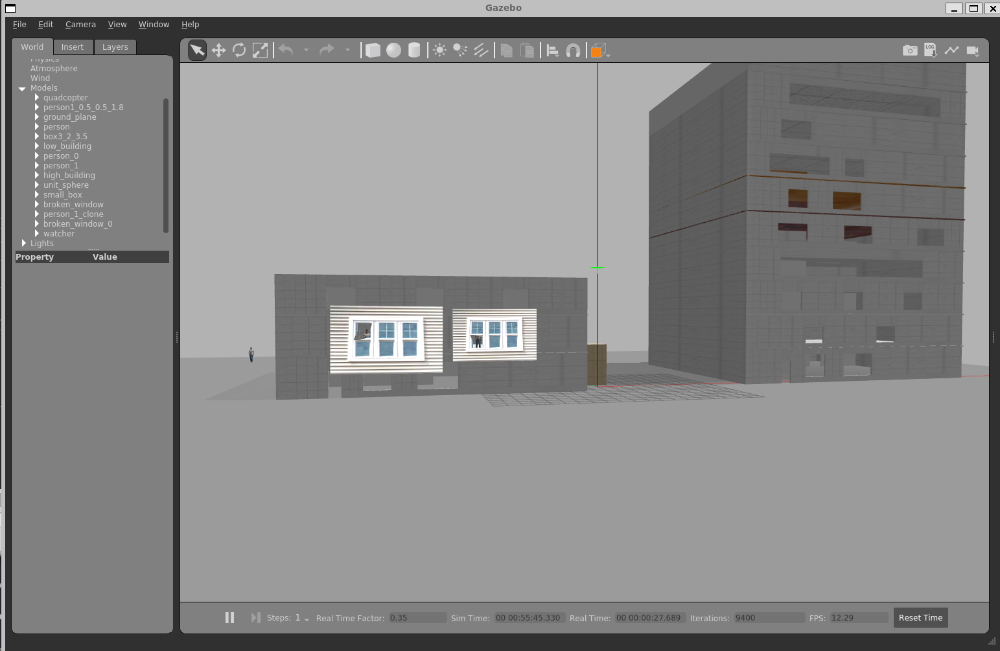
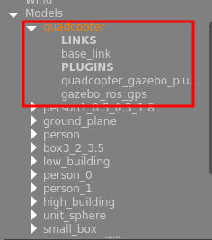
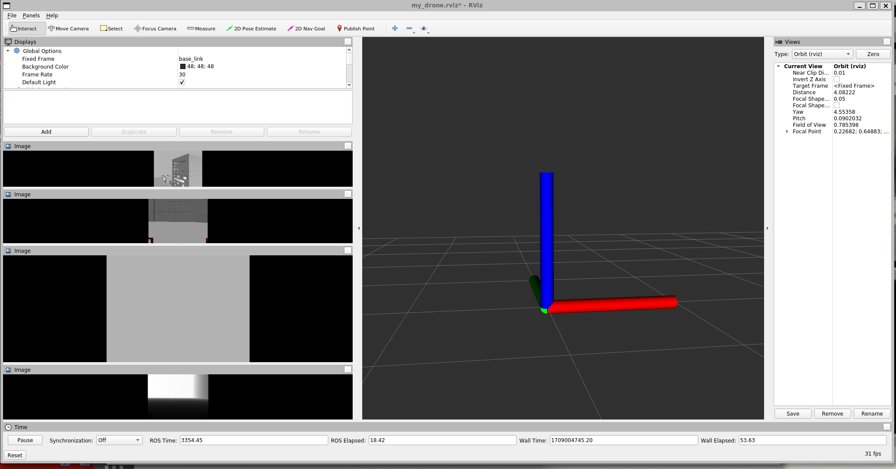
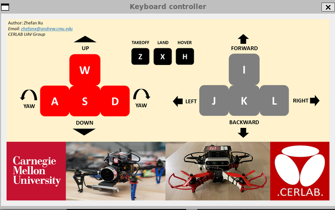

## `详细说明见原仓库README文件参考`:[README.en.md](README.en.md)

## I. 安装说明
建议使用ROS Noetic with Ubuntu 20.04,但也支持ROS Melodic with Ubuntu 18.04，但可能自带的gazebo版本会出现一些问题。
ROS packages依赖: [octomap](https://wiki.ros.org/octomap), [mavros](https://wiki.ros.org/mavros), and [vision_msgs](https://wiki.ros.org/vision_msgs). 

使用如下命令安装:

``` bash
# install dependencies
sudo apt install ros-${ROS_DISTRO}-octomap* && sudo apt install ros-${ROS_DISTRO}-mavros* && sudo apt install ros-${ROS_DISTRO}-vision-msgs
```
## II. 设置工作空间
使用如下命令：
``` bash
cd
mkdir -p drone_ws/src; cd drone_ws/src
cd drone_ws/src
git clone https://gitee.com/csc105/bq-uav-simulator-cmu.git --recursive
cd .. # pwd: drone_ws
catkin_make

# 设置ROS环境变量 zsh终端请使用
source devel/setup.zsh && source src/bq-uav-simulator-cmu/uav_simulator/gazeboSetup.zsh
# or bash终端请使用
source devel/setup.bash && source src/bq-uav-simulator-cmu/uav_simulator/gazeboSetup.bash
```

## III. 启动仿真环境
```
# start simulator
roslaunch uav_simulator start.launch
```
弹出三个窗口：
1. Gazebo
  
  **所用模型如图，红框标注为无人机模型，右键"move to"可切换至观察视角**
<div align=center>

  
</div>

2. rviz
  

3. 操控键盘
  z:起飞
  x:降落
  w:上升
  s:下降
  a:yaw轴逆时针旋转
  d:yaw轴顺时针旋转
  i:向前
  k:向后
  j:向左
  l:向右
  


查看话题`rostopic list` 列出其中几个:
* 相机
  * 前向相机：

    `/camera/color/camera_info` 相机参数<br>
    `/camera/color/image_raw` 相机彩色图像<br>
    `/camera/depth/image_raw` 相机深度图像<br>
    `/camera/depth/points` 相机深度转点云（插件自带）<br>
    
  * 左向相机（主要用来模拟TOF点阵,但深度相机其他功能也可用，同前向相机）：

    `/camera_left/depth/pointcloud_filtered` 8*8点阵

  * 右向相机（主要用来模拟TOF点阵,但深度相机其他功能也可用，同前向相机）：

    `/camera_right/depth/pointcloud_filtered` 8*8点阵

  * 下视相机（主要用来模拟TOF点阵,但深度相机其他功能也可用，同前向相机）：

    `/camera_bottom/depth/pointcloud_filtered` 8*8点阵

* GPS
  * 机载GPS
  
    `/gps/fix` GPS位置
    `/gps/fix_velocity` GPS速度

* 飞控
  * 机载IMU
    `/CERLAB/quadcopter/acc` 加速度计
    `/CERLAB/quadcopter/pose` 无人机位姿（四元数）
    `/CERLAB/quadcopter/vel` 速度
  * 操控
    `/CERLAB/quadcopter/cmd_vel` 操控无人机
